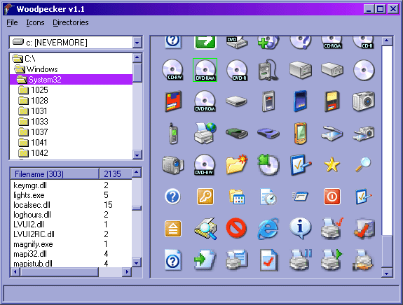



## Woodpecker 1\.1 \[Icon Viewer and Ripper\]

### Description

Woodpecker is a complete icon viewing application contained in a single form.

It processes all .exe, .dll, .ico, and .cur files within a given directory and displays the ones with icons in the first column and the number of icons in the second.

Woodpecker is able to copy icons to the clipboard, save icons as bitmaps, and load all icons within a given directory.

During testing, I was able to process 2039 files and load the 303 of them that had icons into the file list along with their number of icons in 10 seconds. I then loaded the 2135 icons in those files in 20 seconds and positioned them in roughly 55 seconds. My shell32.dll file alone had a whooping 238 icons in it!

The only bug I've found so far is due to the Vertical Scrollbars limited max value. If you load more icons than can be fit, than you won't be able to scroll (this shouldn't be a problem unless you're loading the entire system32 directory).
 
### More Info
 

             |
---                |---
**Submitted On**   |2002-07-29 18:44:16
**By**             |[Michael Drotar](https://github.com/Planet-Source-Code/PSCIndex/blob/master/ByAuthor/michael-drotar.md)
**Level**          |Beginner
**User Rating**    |3.9 (39 globes from 10 users)
**Compatibility**  |VB 4\.0 \(32\-bit\), VB 5\.0, VB 6\.0
**Category**       |[Complete Applications](https://github.com/Planet-Source-Code/PSCIndex/blob/master/ByCategory/complete-applications__1-27.md)
**World**          |[Visual Basic](https://github.com/Planet-Source-Code/PSCIndex/blob/master/ByWorld/visual-basic.md)
**Archive File**   |[Woodpecker1122337292002\.zip](https://github.com/Planet-Source-Code/michael-drotar-woodpecker-1-1-icon-viewer-and-ripper__1-37335/archive/master.zip)

